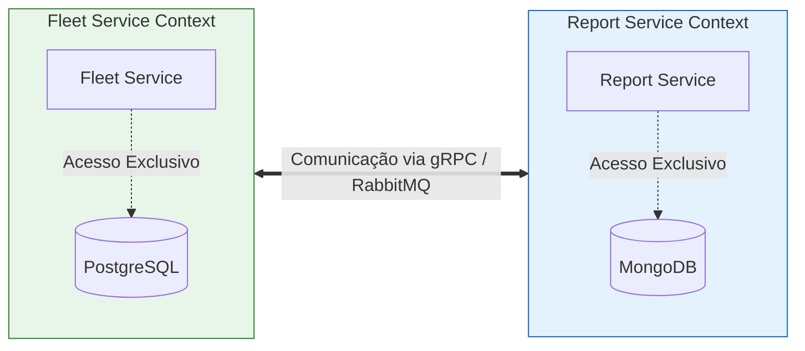
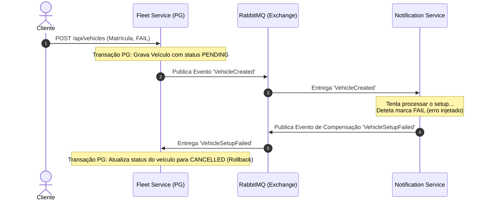

# Relatório de Arquitetura de Software - Fase 3: Microserviços, Persistência e Interoperabilidade

**Mestrado em Informática Aplicada**  
**Tema:** Sistema de Telemetria e Gestão de Frota  
**Objetivo da Fase:** Decomposição do Monólito Modular em Microserviços autónomos com persistência poliglotas isolada, comunicação síncrona (gRPC) e assíncrona (RabbitMQ), transações distribuídas (Saga), resiliência (Circuit Breaker) e observabilidade (Tracing Distribuído), respeitando estritamente o **Princípio da Inversão de Dependência (DIP)** e execução **100% Local**.

---

## 1. Decomposição DDD e Bounded Contexts

Nesta fase, o monólito modular (Fases 1 e 2) foi decomposto em três microserviços independentes, cada um correspondendo a um contexto delimitado (*Bounded Context*) bem definido no domínio da telemetria:

### 1. **Fleet Service (Serviço de Frota)**
* **Responsabilidade:** Gere o ciclo de vida dos veículos (`Vehicle.js`), regras de frota, autenticação de REST API e persistência de frota.
* **Interfaces Técnicas:** Expõe uma REST API para operações administrativas e um servidor **gRPC** síncrono para listagem rápida de veículos.

### 2. **Report Service (Serviço de Relatórios)**
* **Responsabilidade:** Gere a fila de jobs de geração de relatórios pesados de telemetria, o processamento assíncrono via `ReportWorker.js` e a persistência de estados de processamento.
* **Interfaces Técnicas:** Expõe uma REST API para solicitação de relatórios (WQW) e consulta de jobs. Integra um cliente gRPC resiliente.

### 3. **Notification / Audit Service (Serviço de Notificação e Auditoria)**
* **Responsabilidade:** Consome eventos transversais do barramento assíncrono para emitir notificações ao utilizador e consolidar registos de auditoria técnica.
* **Interfaces Técnicas:** Inteiramente baseado no consumo assíncrono de eventos via filas dedicadas do RabbitMQ (*Event-Driven Consumer*).

---

## 2. Persistência e Data Ownership (Isolamento de Base de Dados)

Cumprindo o requisito crítico de **Data Ownership**, eliminámos as implementações em memória e dotámos cada serviço da sua própria base de dados persistente. O acesso direto de um serviço à base de dados de outro é terminantemente proibido.



### Bases de Dados Adotadas:
1. **Fleet Service (PostgreSQL 15):** Utiliza uma base de dados relacional. Os veículos possuem dados estruturados com relações claras e requerem forte consistência transacional (ACID) para operações de frota e validações de matrículas únicas.
2. **Report Service (MongoDB 6):** Utiliza uma base de dados NoSQL documental. Ideal para armazenar os logs de execução de jobs e os relatórios gerados que possuem uma estrutura semi-estruturada/flexível e podem sofrer alterações no schema dos resultados à medida que novos sensores de telemetria são adicionados ao sistema.

---

## 3. Comunicação Inter-Serviços e DIP

Para manter a conformidade com o **DIP (Dependency Inversion Principle)** com avaliação máxima, as camadas internas do Core de ambos os serviços não possuem qualquer dependência direta de bibliotecas de transporte (como `@grpc/grpc-js` ou `amqplib`).

### A. Comunicação Síncrona (gRPC)
O `ReportWorker` necessita de obter a lista de veículos para processar um relatório pesado. Criámos um fluxo gRPC baseado no protocolo binário gRPC:

* **Contrato (Porto) no Core do Report Service:**
  ```javascript
  class IVehicleDataClient {
      async getVehicles(correlationId) { throw new Error("..."); }
  }
  ```
* **Adaptador de Infraestrutura:** A classe `GrpcVehicleClient` implementa `IVehicleDataClient`, carrega o ficheiro `fleet.proto` e executa a chamada gRPC encapsulada num Circuit Breaker.
* **Injeção de Dependência:** O adaptador é instanciado na Composition Root do `report-service` e injetado no construtor do `ReportWorker`. O Core permanece 100% agnóstico da tecnologia gRPC.

### B. Comunicação Assíncrona (RabbitMQ)
O barramento em memória `InMemoryEventBus` foi substituído pelo **RabbitMQ Event Bus** real sobre uma exchange do tipo `topic` (`events_exchange`).
* **Inversão de Dependência:** O Core de todos os serviços continua a chamar apenas `this.eventBus.publish(eventName, payload, correlationId)` herdado do porto `IEventBus.js`.
* **Resiliência e Isolamento:** Cada microservice subscreve eventos gerando filas persistentes duráveis (`durable: true`) com nomes específicos (ex: `notification-service_VehicleCreated_queue`), garantindo que se o serviço de notificações for abaixo, as mensagens acumulam no broker e são processadas quando o serviço recuperar.

---

## 4. Transações Distribuídas (Padrão Saga Coreografada)

Para garantir a consistência eventual sem partilha de base de dados, implementámos o **Padrão Saga** baseado em Coreografia para o registo de veículos:



1. **Estado Inicial:** O `FleetService` regista um veículo na tabela PostgreSQL com o estado inicial `PENDING` e publica o evento `VehicleCreated` com um `correlationId`.
2. **Processamento Assíncrono:** O `NotificationService` consome o evento.
   * **Fluxo de Sucesso:** Se a configuração correr bem, publica `VehicleSetupCompleted`. O `FleetService` ouve o evento e altera o estado do veículo na BD para `ACTIVE` (Commit).
   * **Fluxo de Compensação (Rollback):** Se detetar a marca `"FAIL"`, o setup falha e publica o evento de compensação `VehicleSetupFailed`. O `FleetService` ouve o evento de erro e atualiza o estado na base de dados para `CANCELLED`.

---

## 5. Resiliência Avançada (Circuit Breaker)

Na chamada síncrona gRPC efetuada pelo `ReportService` para o `FleetService`, a chamada de rede foi envolvida com a biblioteca **opossum** que implementa o padrão **Circuit Breaker**:

* **Funcionamento:** Se o `fleet-service` for abaixo (injetado parando o contentor), as chamadas de rede começam a falhar. Após atingir a taxa de insucesso de 50% ou timeout, o circuito **abre**.
* **Proteção contra Falha em Cascata:** Com o circuito aberto, o `ReportService` rejeita imediatamente os novos pedidos sem iniciar chamadas gRPC que ficariam penduradas até esgotar o timeout, executando a lógica de fallback (lançando erro amigável ao worker).
* **Auto-Recuperação:** Após 10 segundos, o circuito passa a **Half-Open**, permitindo testar se o `fleet-service` está novamente ativo antes de restabelecer o funcionamento normal.

---

## 6. Observabilidade Distribuída (Distributed Tracing)

Assegurámos que o mesmo ID de rastreio (`correlationId`) viaja de forma transparente por todos os contentores do sistema:

1. **REST API:** O middleware `tracingMiddleware.js` deteta ou gera o `correlationId` no cabeçalho HTTP da rota.
2. **Chamadas gRPC:** Injetado nos metadados da chamada no cliente (`GrpcVehicleClient`) e extraído no servidor (`GrpcServer`).
3. **Eventos RabbitMQ:** Incorporado no payload serializado em JSON que trafega no broker.
4. **Logs Estruturados:** O `ConsoleLogger` imprime todas as operações com o `[CorrelationID: XXX]` correspondente, permitindo rastrear o ciclo completo de um pedido na consola.

---

## 7. Análise de Trade-offs e Sustentabilidade

A migração de um **Monólito Modular** para uma **Arquitetura de Microserviços** traz sérias implicações estruturais e ambientais que devem ser analisadas criticamente.

### Análise Comparativa (Monólito vs Microserviços):

| Métrica / Dimensão | Monólito Modular (Fases 1 e 2) | Microserviços Distribuídos (Fase 3) |
| :--- | :--- | :--- |
| **Complexidade Operacional** | Baixa (Processo único, BD única) | Elevada (Orquestração de contentores, Broker, Múltiplas BDs) |
| **Escalabilidade** | Vertical (Escala-se o bloco inteiro) | Horizontal Independente (Pode-se escalar apenas o Worker de Relatórios) |
| **Latência de Comunicação** | Praticamente zero (Chamadas em memória) | Mais alta (Overhead de serialização e rede gRPC/RabbitMQ) |
| **Isolamento de Falhas** | Fraco (Um crash na API de frota pode deitar abaixo os relatórios) | Excelente (Se o FleetService falhar, o ReportService continua ativo) |
| **Consumo Energético / Computacional** | Baixo | Muito Elevado (Múltiplos runtimes Node, instâncias de BD e Message Broker) |

### Sustentabilidade Energética (Foco Ambiental):
O monólito modular partilha a memória RAM e o CPU do sistema operativo host, correndo num único runtime. Em contrapartida, a arquitetura de microserviços requer o arranque de pelo menos 6 processos isolados (3 bases de dados/broker e 3 runtimes Node) em contentores Docker.

* **Custo Energético:** Esta redundância consome substancialmente mais memória, ciclos de CPU e eletricidade para manter as sockets de rede abertas e gerir transações de IO persistentes em bases de dados poliglotas.
* **Justificação de Negócio:** Este consumo acrescido só é justificável em cenários de **grande escala**, onde o volume de dados de telemetria enviados por milhares de veículos sobrecarregaria o monólito, ou onde equipas de desenvolvimento diferentes precisam de autonomia para alterar o código do Fleet Service sem arriscar quebrar o Report Service. Para volumes pequenos ou académicos, o monólito modular é energeticamente muito mais sustentável.

---

## 8. Uso de Inteligência Artificial (IA)

Conforme a metodologia de transparência adotada desde o início do projeto, documentamos a interação com a IA na Fase 3:

| Ferramenta | Tarefa no Projeto | Adaptação / Rejeição / Intervenção Manual |
| :--- | :--- | :--- |
| **Antigravity (Gemini)** | Esboço inicial do plano de migração | Aceite. A estruturação por bounded contexts mapeou perfeitamente os requisitos da UC. |
| **Antigravity (Gemini)** | Criação de Dockerfiles e docker-compose.yml | **Intervenção Manual:** Adicionados volumes persistentes nomeados para PostgreSQL e MongoDB e ajustadas as dependências de rede (`depends_on`) para inicialização segura dos contentores. |
| **Antigravity (Gemini)** | Adaptador PostgresVehicleRepo.js com pg | **Adaptação:** A IA sugeriu usar Sequelize. Foi rejeitado para evitar sobrecarga de ORM e substituído por uma implementação pura com `pg Pool` e um script de inicialização de tabelas com auto-retry caso a BD demore a arrancar. |
| **Antigravity (Gemini)** | Adaptador MongoJobStore.js com mongodb | **Aceite:** Implementação de save, get e updateStatus baseada no driver de baixo nível de MongoDB. |
| **Antigravity (Gemini)** | Adaptador RabbitMQEventBus.js | **Intervenção Manual:** O código sugerido usava queues anónimas exclusivas. Foi reescrito manualmente para criar queues persistentes com o nome do microserviço (`serviceName_queue`) garantindo que as mensagens de Sagas não se perdem quando um serviço é reiniciado. |
| **Antigravity (Gemini)** | Implementação gRPC (fleet.proto e GrpcServer) | **Aceite:** Estrutura limpa que isola o Core e injeta o `correlationId` nos metadados gRPC. |
| **Antigravity (Gemini)** | Implementação do Circuit Breaker com Opossum | **Adaptação:** A IA sugeriu um fallback que retornava veículos falsos/mockados. Decidiu-se reescrever o fallback para lançar uma exceção explícita de indisponibilidade de serviço, permitindo ao ReportWorker acionar a sua própria lógica de retry exponencial e DLQ técnica. |
| **Antigravity (Gemini)** | Relatório e Análise de Sustentabilidade | **Intervenção Manual:** Edição de todo o conteúdo para Português de Portugal e refinamento crítico dos trade-offs energéticos. |

---

## 9. Como Testar e Demonstrar a POC (Injeção de Falhas)

### Requisitos Iniciais:
1. Certifique-se de que o Docker Desktop (ou daemon do Docker) está a correr na sua máquina Windows.
2. Inicie o cluster na raiz do projeto executando:
   ```bash
   docker compose up --build
   ```
3. O painel do RabbitMQ ficará acessível em `http://localhost:15672` (guest/guest).

---

### Cenario 1: Demonstração da Saga (Fluxo de Sucesso)
Registar um veículo válido. O veículo é gravado como `PENDING` e logo a seguir atualizado para `ACTIVE` pelo processamento assíncrono das notificações.

**Pedido cURL:**
```bash
curl -X POST http://localhost:3001/api/vehicles \
  -H "Content-Type: application/json" \
  -H "Authorization: super-secret-token-fase1" \
  -d '{"id": "v-sucesso", "licensePlate": "AA-00-OK", "brand": "Tesla", "currentSpeed": 60}'
```

**Logs a Monitorizar (Consola docker-compose):**
1. O `fleet-service` gera um `correlationId` e regista o veículo como `PENDING` na base de dados PostgreSQL.
2. O `notification-service` consome o evento `VehicleCreated` com o mesmo `correlationId` e publica `VehicleSetupCompleted`.
3. O `fleet-service` processa o evento de sucesso e altera o estado do veículo `v-sucesso` na base de dados para `ACTIVE`.

---

### Cenario 2: Demonstração da Saga (Compensação / Rollback)
Registar um veículo com marca `"FAIL"`. O setup irá falhar e o estado do veículo será revertido para `CANCELLED` de forma assíncrona.

**Pedido cURL:**
```bash
curl -X POST http://localhost:3001/api/vehicles \
  -H "Content-Type: application/json" \
  -H "Authorization: super-secret-token-fase1" \
  -d '{"id": "v-falha", "licensePlate": "XX-99-ERR", "brand": "FAIL", "currentSpeed": 0}'
```

**Logs a Monitorizar:**
1. O `fleet-service` regista o veículo como `PENDING` e publica `VehicleCreated`.
2. O `notification-service` deteta a marca `"FAIL"` e emite `VehicleSetupFailed` com a razão do erro.
3. O `fleet-service` recebe o evento de erro de compensação e altera o estado de `v-falha` na base de dados PostgreSQL para `CANCELLED`.
4. O `AuditConsumer` emite um alerta vermelho de auditoria.

---

### Cenario 3: Demonstração de Tracing Distribuído
Verifique a consola do Docker Compose. Procure por qualquer operação correspondente a um dos pedidos cURL efetuados. O mesmo identificador de correlação (ex: `[CorrelationID: a2b3-...]`) estará impresso:
* No Express HTTP do `fleet-service`
* No evento processado pelo `notification-service`
* Nos logs de auditoria do `AuditConsumer`

---

### Cenario 4: Demonstração do Circuit Breaker (Injeção de Falhas)
1. Efetue um pedido de geração de relatório síncrono.
   ```bash
   curl -X POST http://localhost:3002/api/reports/generate \
     -H "Content-Type: application/json" \
     -d '{"vehicleId": "v-sucesso"}'
   ```
   *Resposta esperada:* `202 Accepted` com um `jobId`. Aceda a `http://localhost:3002/api/reports/<jobId>` após alguns segundos para ver o relatório gerado com sucesso contendo o veículo Tesla obtido via gRPC.

2. **Derrube o Fleet Service:**
   ```bash
   docker compose stop fleet-service
   ```

3. **Submeta novos pedidos de relatórios:**
   ```bash
   curl -X POST http://localhost:3002/api/reports/generate \
     -H "Content-Type: application/json" \
     -d '{"vehicleId": "v-sucesso"}'
   ```
   Observe os logs do `report-service`. A chamada gRPC falhará imediatamente.
   Após 3 tentativas falhadas (ou novos pedidos repetidos), observe a consola:
   `🚨 [Circuit Breaker] O circuito abriu! As chamadas ao FleetService gRPC estão bloqueadas temporariamente.`
   Os pedidos seguintes falharão imediatamente sem qualquer espera de timeout no gRPC, ativando a DLQ e logs de erro apropriados.

4. **Recupere o Fleet Service:**
   ```bash
   docker compose start fleet-service
   ```
   Após o resetTimeout de 10s, envie um novo pedido de relatório. Verá o circuito transitar para `halfOpen`, testar o serviço e finalmente fechar (`close`), restabelecendo a operação normal e logs verdes de sucesso!
